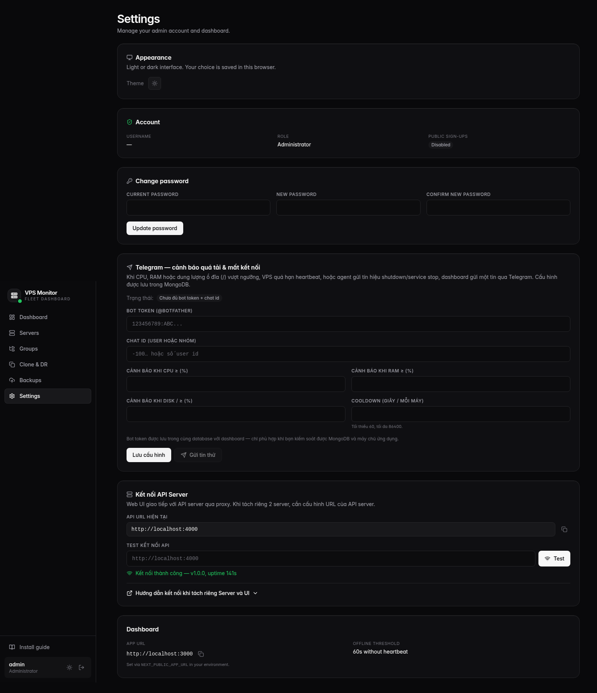

# Hướng dẫn Deploy VPS Monitor

## Tổng quan

VPS Monitor gồm 3 thành phần:
- **API Server** (Express, port 4000) — xử lý tất cả API, Telegram bot
- **Web UI** (Next.js, port 3000) — giao diện dashboard
- **MongoDB** — database

Bạn có thể deploy theo nhiều cách:

---

## Cách 1: Docker Compose (đơn giản nhất)

```bash
git clone https://github.com/quatang20172-dotcom/vps-monitoring.git
cd vps-monitoring
cp .env.example .env

# Chỉnh .env
nano .env

docker compose up -d
```

---

## Cách 2: Chạy trực tiếp trên server

### Yêu cầu
- Node.js 18+ (khuyến khích 20+)
- MongoDB 6+ (local hoặc Atlas)
- PM2 (process manager)

### Cài đặt

```bash
# Clone repo
git clone https://github.com/quatang20172-dotcom/vps-monitoring.git
cd vps-monitoring

# Install dependencies
npm install

# Setup env
cp .env.example .env
nano .env  # chỉnh MONGODB_URI, JWT_SECRET, NEXT_PUBLIC_APP_URL

# Build
npm run build

# Chạy với PM2
pm2 start "cd packages/api && npx tsx src/index.ts" --name vps-api
pm2 start "cd packages/web && npx next start" --name vps-web
pm2 save
pm2 startup
```

---

## Cách 3: Deploy riêng API và UI

### Server A — API Server

```bash
# Clone và install
git clone https://github.com/quatang20172-dotcom/vps-monitoring.git
cd vps-monitoring && npm install && npm run build:shared

# .env
cat > .env << 'EOF'
MONGODB_URI=mongodb://localhost:27017/vps-monitoring
JWT_SECRET=your-long-random-secret
NEXT_PUBLIC_APP_URL=https://monitor.yourdomain.com
API_PORT=4000
WEB_ORIGINS=https://monitor.yourdomain.com
EOF

# Chạy
pm2 start "cd packages/api && npx tsx src/index.ts" --name vps-api
```

### Server B — Web UI

```bash
# Clone và install
git clone https://github.com/quatang20172-dotcom/vps-monitoring.git
cd vps-monitoring && npm install && npm run build

# .env
cat > .env << 'EOF'
MONGODB_URI=mongodb://serverA:27017/vps-monitoring
JWT_SECRET=your-long-random-secret  # PHẢI GIỐNG Server A
NEXT_PUBLIC_APP_URL=https://monitor.yourdomain.com
API_URL=http://serverA:4000
EOF

# Chạy
pm2 start "cd packages/web && npx next start" --name vps-web
```

### Test kết nối từ UI

Sau khi deploy, vào **Settings** → mục **"Kết nối API Server"**:

1. Kiểm tra API URL hiện tại có đúng không
2. Paste URL API server vào ô **"Test kết nối API"**
3. Nhấn **"Test"** → kết quả hiện ngay:
   - **Thành công**: `Kết nối thành công — v1.0.0, uptime XXs` (màu xanh)
   - **Lỗi**: hiện thông báo lỗi (màu đỏ)



### Reverse Proxy (Nginx)

```nginx
server {
    listen 443 ssl;
    server_name monitor.yourdomain.com;

    ssl_certificate /etc/ssl/certs/monitor.pem;
    ssl_certificate_key /etc/ssl/private/monitor.key;

    # API
    location /api/ {
        proxy_pass http://serverA:4000;
        proxy_http_version 1.1;
        proxy_set_header Host $host;
        proxy_set_header X-Real-IP $remote_addr;
        proxy_set_header X-Forwarded-For $proxy_add_x_forwarded_for;
        proxy_set_header X-Forwarded-Proto $scheme;
    }

    # Agent scripts
    location /scripts/ {
        proxy_pass http://serverA:4000;
    }

    # Web UI
    location / {
        proxy_pass http://serverB:3000;
        proxy_http_version 1.1;
        proxy_set_header Upgrade $http_upgrade;
        proxy_set_header Connection 'upgrade';
        proxy_set_header Host $host;
        proxy_cache_bypass $http_upgrade;
    }
}
```

---

## Cách 4: Deploy Web UI lên Vercel/Netlify

Web UI có thể deploy lên Vercel miễn phí, API server vẫn chạy trên VPS:

1. Push code lên GitHub
2. Import project vào Vercel
3. Set root directory: `packages/web`
4. Set environment variables:
   - `API_URL=https://api.yourdomain.com`
   - `NEXT_PUBLIC_APP_URL=https://your-app.vercel.app`
   - `MONGODB_URI=...`
   - `JWT_SECRET=...`
5. Trên VPS (API server), set `WEB_ORIGINS=https://your-app.vercel.app` để cho phép CORS

---

## SSL / HTTPS

Luôn dùng HTTPS cho production. Caddy tự động cấp SSL:

```
# Caddyfile
monitor.yourdomain.com {
    handle /api/* {
        reverse_proxy localhost:4000
    }
    handle {
        reverse_proxy localhost:3000
    }
}
```

Hoặc dùng Certbot + Nginx:
```bash
sudo certbot --nginx -d monitor.yourdomain.com
```

---

## Biến môi trường quan trọng

| Biến | Bắt buộc | Mô tả |
|------|---------|-------|
| `MONGODB_URI` | Có | MongoDB connection string |
| `JWT_SECRET` | Có (prod) | Secret cho JWT/session cookies. **Phải giống nhau** trên API và Web |
| `NEXT_PUBLIC_APP_URL` | Có | URL public truy cập dashboard |
| `API_PORT` | Không | Port cho API server (mặc định 4000) |
| `API_URL` | Không | URL API server (Next.js proxy target, mặc định `http://localhost:4000`) |
| `WEB_ORIGINS` | Không | CORS allowed origins (mặc định `http://localhost:3000`) |
| `AGENT_OFFLINE_AFTER_SECONDS` | Không | Thời gian trước khi đánh agent offline (mặc định 60s) |
| `GOOGLE_CLIENT_ID` | Không | Google OAuth2 Client ID |
| `GOOGLE_CLIENT_SECRET` | Không | Google OAuth2 Client Secret |
| `BACKUP_ENCRYPTION_KEY` | Không | AES key mã hóa cloud credentials (mặc định = JWT_SECRET) |

---

## Health Check Endpoint

API server cung cấp endpoint `/api/health` để kiểm tra kết nối:

```bash
# Test từ terminal
curl http://localhost:4000/api/health

# Response:
# {"ok":true,"service":"vps-monitoring-api","version":"1.0.0","uptime":141,"port":4000}

# Test database connection
curl http://localhost:4000/api/health/db

# Response:
# {"ok":true,"database":"vps-monitoring"}
```

Endpoint `/api/health` có CORS `*` (cho phép gọi từ bất kỳ domain nào), phục vụ cho tính năng "Test kết nối" trên UI Settings.

---

## Troubleshooting

### UI không kết nối được API

1. Kiểm tra API server đang chạy: `curl http://localhost:4000/api/health`
2. Kiểm tra `API_URL` trong `.env` của Web UI
3. Vào **Settings** → "Kết nối API Server" → nhấn **Test** để xem lỗi chi tiết
4. Nếu deploy 2 server khác nhau, kiểm tra `WEB_ORIGINS` trên API server có chứa domain UI
5. Restart UI server sau khi thay đổi `API_URL`

### Agent không gửi metrics

1. Kiểm tra agent: `sudo systemctl status vps-monitor-agent`
2. Xem logs: `sudo journalctl -u vps-monitor-agent -f`
3. Kiểm tra API server reachable từ VPS: `curl http://API_SERVER/api/health`

### Telegram bot không hoạt động

1. Kiểm tra bot token đã cấu hình trong Settings
2. Restart API server sau khi thay đổi token
3. Chi tiết: [telegram-bot-setup.md](telegram-bot-setup.md)
